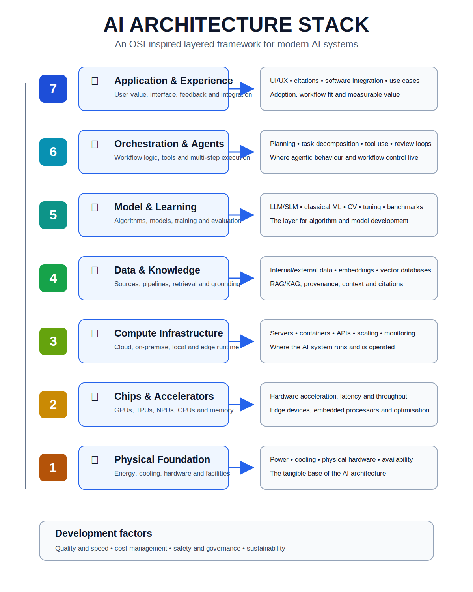
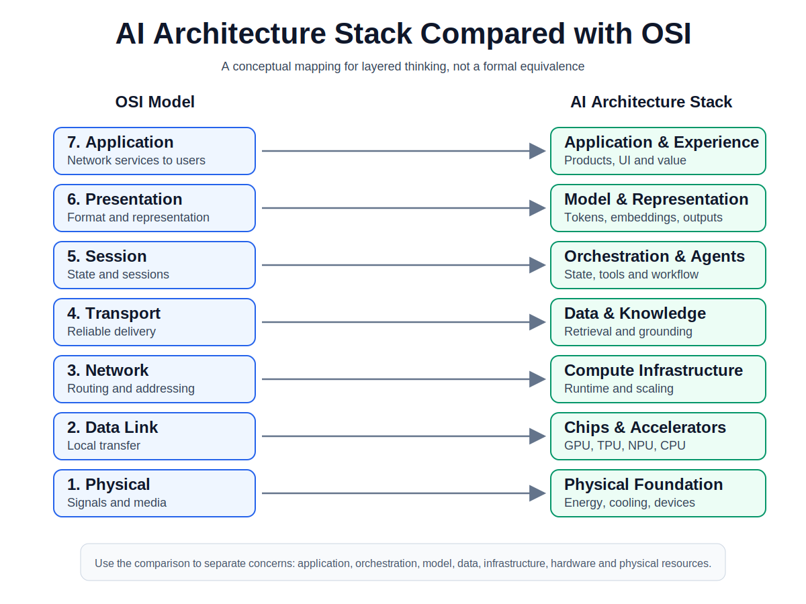
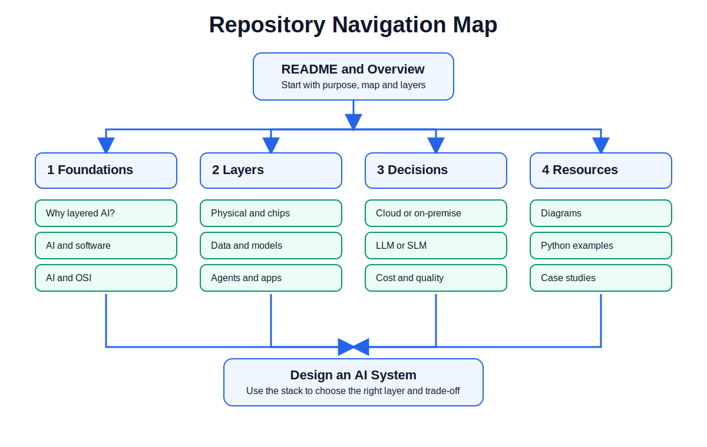
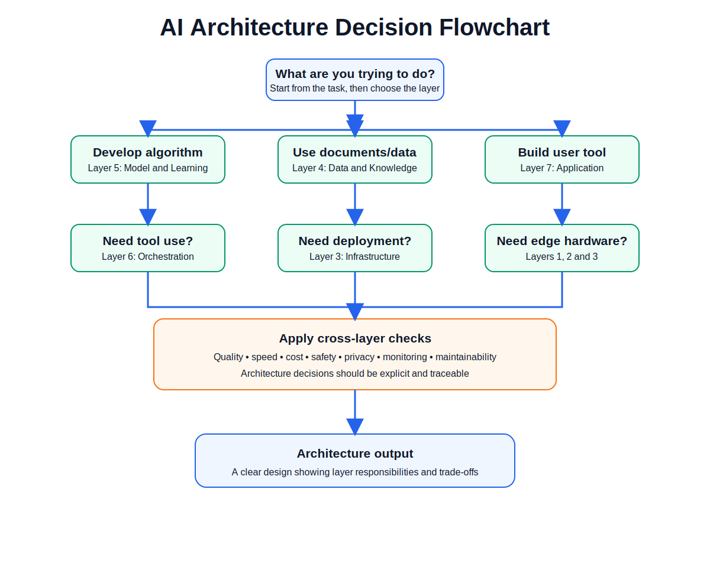
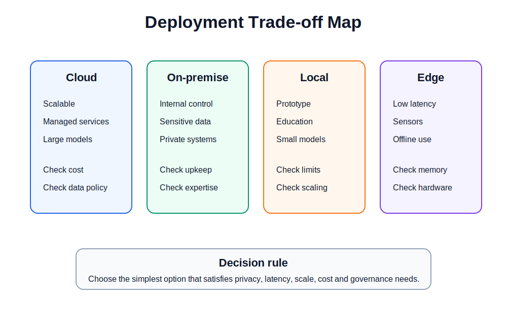

# The AI Architecture Stack

**An OSI-inspired layered framework for understanding how modern AI systems are built, deployed, and governed.**

This repository presents a practical architecture model for modern AI systems. It is designed for readers who want to understand where different AI activities belong: where algorithms are developed, where data and knowledge are managed, where models are trained or selected, where agents and tools are orchestrated, where infrastructure decisions are made, and where governance and safety controls should be applied.

The idea is inspired by layered thinking in networking, especially the OSI model and TCP/IP model. The purpose is not to claim that AI systems behave exactly like networks. Instead, the purpose is to use the same clarity of abstraction: each layer has a role, each layer depends on the layers below it, and design decisions at one layer affect the whole system.

---

## Visual overview

---

## Why this repository exists

AI is often described as a model, an application, a chatbot, or a cloud service. In practice, a useful AI system is a full stack. It depends on physical resources, chips, compute infrastructure, data pipelines, knowledge stores, models, orchestration logic, user interfaces, governance processes, and operational constraints.

This repository helps readers answer practical questions such as:

- If I want to develop an algorithm, which layer am I working in?
- If I want to use an LLM or SLM, what architecture choices do I need to consider?
- If I need private or sensitive data, should I use cloud, on-premise, local, or edge deployment?
- If I want to build a RAG system, where do data pipelines, vector databases, retrieval, grounding, and citations fit?
- If I want to add agents or tool use, which layer should I design and monitor?
- If I want to govern safety, quality, cost, and speed, where should controls be applied?

---

## The seven-layer AI architecture

| Layer | Name | Main purpose | Typical work |
|---:|---|---|---|
| 7 | Application & Experience | Deliver user-facing value | UI/UX, products, copilots, dashboards, workflows, user feedback |
| 6 | Orchestration & Agents | Coordinate tasks, tools, memory, and multi-step workflows | Agent loops, planning, tool execution, task decomposition, workflow logic |
| 5 | Model & Learning | Provide the intelligence engine | Model selection, training, fine-tuning, evaluation, reasoning behaviour |
| 4 | Data & Knowledge | Provide information, context, and grounding | Data sources, pipelines, embeddings, vector databases, RAG/KAG |
| 3 | Compute Infrastructure | Run and scale the system | Cloud, on-premise, local runtime, servers, containers, monitoring |
| 2 | Chips & Accelerators | Convert energy into efficient computation | GPUs, TPUs, NPUs, memory, accelerators, edge devices |
| 1 | Physical Foundation | Provide the physical base | Energy, power, cooling, hardware systems, data centres |

---

## AI architecture compared with OSI and TCP/IP

The OSI model separates networking into seven conceptual layers so that engineers can reason clearly about complex systems. This repository applies the same layered thinking to AI architecture.

| OSI concept | AI architecture analogy | Explanation |
|---|---|---|
| Physical | Physical Foundation | Power, cooling, hardware, physical deployment environment |
| Data Link | Chips & Accelerators | Hardware-level movement and acceleration of computation |
| Network | Compute Infrastructure | Distributed runtime, cloud/on-prem/local environments, connectivity |
| Transport | Data & Knowledge | Reliable movement and preparation of information for models |
| Session | Orchestration & Agents | Maintaining task state, workflow continuity, tool sessions, memory |
| Presentation | Model & Representation | Transforming raw inputs into embeddings, features, tokens, outputs |
| Application | Application & Experience | End-user systems, products, copilots, automation, decision support |

The mapping is intentionally conceptual. It is a learning and design tool, not a replacement for formal networking theory.

---

## Repository map

| Path | Purpose |
|---|---|
| [`docs/01_why_layered_ai_architecture.md`](docs/01_why_layered_ai_architecture.md) | Explains why AI needs a layered architecture model |
| [`docs/02_osi_tcpip_comparison.md`](docs/02_osi_tcpip_comparison.md) | Compares the AI Architecture Stack with OSI and TCP/IP |
| [`docs/03_seven_layers.md`](docs/03_seven_layers.md) | Defines the seven AI architecture layers in detail |
| [`docs/04_decision_guideline.md`](docs/04_decision_guideline.md) | Helps readers choose the right layer for their work |
| [`docs/05_deployment_patterns.md`](docs/05_deployment_patterns.md) | Compares cloud, on-premise, local, and edge deployment |
| [`docs/06_governance_by_layer.md`](docs/06_governance_by_layer.md) | Shows how governance, quality, cost, safety, and risk apply by layer |
| [`docs/07_glossary.md`](docs/07_glossary.md) | Defines key terms used across the repository |
| [`assets/diagrams/`](assets/diagrams/) | Clean SVG diagrams and flowcharts for the repository |
| [`examples/`](examples/) | Python examples for architecture decision support |
| [`case-studies/`](case-studies/) | Short architecture case studies and templates |
| [`references/`](references/) | Reference notes and further reading |

---

## Reader navigation flow

A good way to use this repository is:

1. Start with the concept: why layered AI architecture matters.
2. Review the OSI/TCP-IP comparison.
3. Study the seven layers.
4. Use the decision guide to identify where your work belongs.
5. Review deployment options and architecture trade-offs.
6. Apply governance and safety checks by layer.
7. Use the examples and case studies to design your own system.

---

## Where should I work?

| Your goal | Most relevant layer |
|---|---|
| Develop a new ML algorithm | Layer 5: Model & Learning |
| Fine-tune or evaluate a model | Layer 5: Model & Learning |
| Build a RAG application | Layer 4: Data & Knowledge + Layer 6: Orchestration |
| Add citations and grounding | Layer 4: Data & Knowledge + Layer 7: Application |
| Create an AI agent | Layer 6: Orchestration & Agents |
| Build a user-facing app | Layer 7: Application & Experience |
| Decide cloud vs on-premise vs local | Layer 3: Compute Infrastructure |
| Deploy on edge hardware | Layer 2: Chips & Accelerators + Layer 3: Compute Infrastructure |
| Manage private or regulated data | Layer 4: Data & Knowledge + Layer 6/7 governance controls |
| Reduce latency or cost | Layers 2, 3, 5, and 6 |
| Improve safety and traceability | Governance controls across all layers |

---

## Architecture decision flowchart

---

## Key architecture trade-offs

Modern AI architecture is not only about choosing a model. It is about balancing constraints.

| Trade-off | Typical question |
|---|---|
| Cloud vs on-premise vs local | Where should the system run? |
| LLM vs SLM | How much capability is needed? |
| Open-source vs proprietary | How much control, transparency, and vendor dependence is acceptable? |
| RAG vs fine-tuning | Should the system retrieve knowledge or learn task behaviour? |
| Agents vs simple workflow | Is autonomy needed, or is deterministic workflow better? |
| Cost vs quality vs speed vs safety | Which constraint dominates the system design? |

---

## Core principles

1. **Separate the layers.** Do not mix data, model, orchestration, application, and infrastructure decisions into one vague discussion.
2. **Start from the use case.** The application layer defines what value the system must deliver.
3. **Work downward for feasibility.** A good AI idea must be supported by data, models, compute, hardware, energy, cost, and governance.
4. **Work upward for value.** Infrastructure only matters when it enables useful applications.
5. **Make trade-offs explicit.** Cost, quality, latency, security, privacy, and safety should be visible architecture decisions.
6. **Govern every layer.** AI governance is not a document at the end; it is a set of controls across the full stack.

---

## Originality note

This repository is an original educational and architectural framework. It uses the OSI and TCP/IP models as inspiration for layered thinking, but it does not copy their structure directly and does not claim a formal standard equivalence. The goal is to help readers reason clearly about AI system design, implementation, deployment, and governance.

---

## License

This project is released under the MIT License. See [`LICENSE`](LICENSE).
