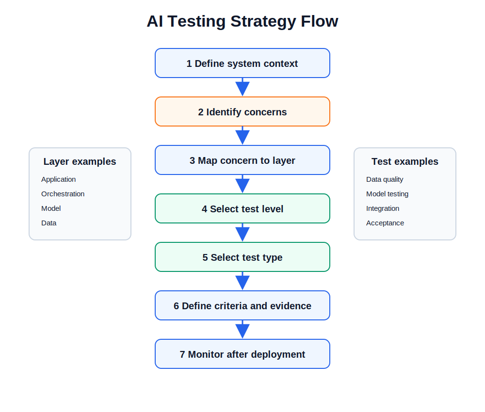

# Risk-Based AI Testing

This page adds a practical risk-based testing view to the AI Architecture Stack. The aim is to help readers identify where an AI risk sits in the architecture and then choose a suitable testing activity.

The content is written as an original educational guide. It does not include any confidential project name, client name, audit detail, or third-party assessment information.

## Core idea

AI testing should be guided by risk. A useful test strategy normally starts with the following sequence:

1. Define the AI system context.
2. Identify potential sources of harm, failure, or poor performance.
3. Map each risk to one or more architecture layers.
4. Select the right test level.
5. Select the right test type.
6. Define acceptance criteria.
7. Record evidence.
8. Monitor the system after deployment.

## Risk mapped to the architecture stack

| Architecture layer | Example risk source | Example testing focus |
|---:|---|---|
| 7. Application and Experience | unclear output, weak user guidance, poor workflow fit | acceptance testing, usability testing, user feedback review |
| 6. Orchestration and Agents | wrong tool use, failed task routing, weak review flow | integration testing, scenario testing, tool-use testing |
| 5. Model and Learning | poor model performance, robustness weakness, subgroup variation | model testing, validation, robustness testing, fairness checks |
| 4. Data and Knowledge | poor data quality, drift, weak provenance, retrieval errors | data quality testing, representativeness testing, retrieval testing |
| 3. Compute Infrastructure | latency, downtime, access control weakness, scaling failure | performance testing, availability testing, security testing |
| 2. Chips and Accelerators | memory limits, hardware mismatch, poor throughput | stress testing, compatibility testing, edge performance testing |
| 1. Physical Foundation | power, cooling, physical availability | continuity checks, operational readiness checks |

## Risk-based testing flow

## Practical risk identification questions

Use these questions during architecture review:

### Application and Experience

- Can the user misunderstand or misuse the output?
- Is the intended use clear?
- Are citations, confidence information, or limitations presented clearly where needed?
- Is there a feedback route for poor outputs?

### Orchestration and Agents

- Can the system call the wrong tool?
- Can a multi-step task fail silently?
- Is there a review step for high-impact actions?
- Are tool calls, inputs, and outputs logged appropriately?

### Model and Learning

- Is model performance acceptable for the intended use?
- Has the model been tested on relevant subgroups and edge cases?
- Is the model robust to realistic variation?
- Is the model version controlled?

### Data and Knowledge

- Is the data representative of the intended operating context?
- Are training, validation, test, and production data separated appropriately?
- Is data provenance recorded?
- Can the retrieval layer return outdated, irrelevant, or misleading information?

### Compute Infrastructure

- Can the system meet latency and availability requirements?
- Are access controls appropriate?
- Is monitoring in place?
- Is there a rollback or recovery plan?

### Chips, Devices, and Physical Foundation

- Can the selected hardware support the workload?
- Is the model suitable for the target device?
- Are power, cooling, memory, and runtime constraints understood?

## Example risk register structure

| ID | Layer | Risk statement | Cause | Possible effect | Test approach | Acceptance criterion | Evidence |
|---|---|---|---|---|---|---|---|
| R1 | Data and Knowledge | The system retrieves irrelevant context | poor chunking or weak search | inaccurate answer | retrieval evaluation | relevant context appears in top results | retrieval test report |
| R2 | Model and Learning | Model performance is weaker for a subgroup | unbalanced data | unequal performance | subgroup evaluation | performance gap within agreed limit | subgroup test report |
| R3 | Orchestration and Agents | Agent selects an unsuitable tool | weak routing logic | wrong action or poor answer | scenario testing | correct tool selected in defined scenarios | scenario test log |
| R4 | Application and Experience | User over-trusts generated output | weak UI communication | inappropriate reliance | usability review | limitations visible to user | UI review record |

## Key message

Risk-based AI testing connects architecture, testing, and governance. The question is not only whether a model is accurate. The stronger question is whether the full AI system is suitable, reliable, traceable, and usable in its intended context.